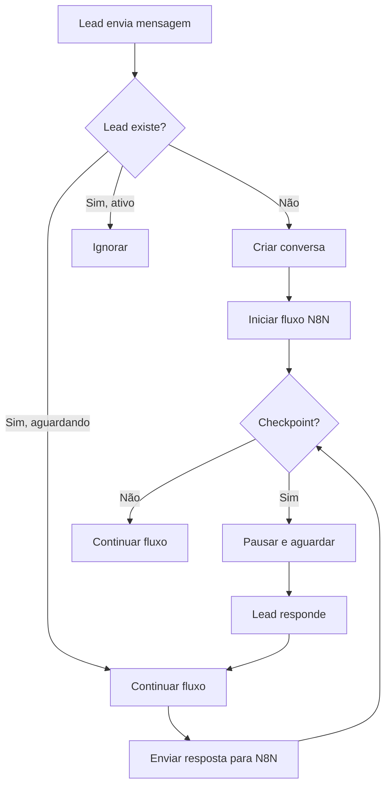

# 🧠 Sistema de Checkpoints WhatsApp

Sistema para gerenciar fluxos de conversas no WhatsApp com checkpoints, integrado com N8N e Evolution API.

## 📋 Funcionalidades

- ✅ **Checkpoint System**: Pausa fluxos aguardando resposta do lead
- 🔄 **Fluxos Múltiplos**: Suporte a vários fluxos simultâneos
- 📱 **Multi-Instâncias**: Rotação automática entre instâncias WhatsApp
- 🗄️ **PostgreSQL**: Persistência de dados e estados
- ⏰ **Timeout Inteligente**: Limpeza automática após 24h
- 📊 **Monitoramento**: Dashboard para acompanhar conversas
- 🔗 **N8N Integration**: Integração bidirecional com N8N

## 🛠️ Pré-requisitos

- Node.js 16+ 
- PostgreSQL 12+
- Evolution API configurada
- N8N configurado

## 🚀 Instalação

### 1. Clone o Repositório

```bash
git clone [URL_DO_SEU_REPO]
cd whatsapp-checkpoint-system
```

### 2. Instale as Dependências

```bash
npm install
```

### 3. Configure as Variáveis de Ambiente

```bash
cp .env.example .env
```

Edite o arquivo `.env` com suas configurações:

```env
# PostgreSQL
DB_HOST=localhost
DB_USER=postgres
DB_PASSWORD=sua_senha
DB_NAME=whatsapp_checkpoints

# URLs dos Serviços  
N8N_WEBHOOK_URL=https://n8n.flowzap.fun/webhook/checkpoint
EVOLUTION_API_URL=https://evo.flowzap.fun

# Sistema
PORT=3000
```

### 4. Configure o Banco de Dados

```bash
# Crie o banco no PostgreSQL primeiro
createdb whatsapp_checkpoints

# Execute o setup automático
npm run db:setup
```

### 5. Inicie o Sistema

```bash
npm start
```

## 📡 Webhooks

### Evolution API → Sistema
Configure no Evolution API:

```
POST http://seu-servidor:3000/webhook/evolution
```

### N8N ← → Sistema
Configure no N8N:

```
POST http://seu-servidor:3000/webhook/checkpoint
```

## 🎯 Como Usar no N8N

### 1. Pausar Fluxo (Checkpoint)

Envie para `/webhook/checkpoint`:

```json
{
  "phone_number": "5511999999999",
  "action": "pause",
  "step": "aguardando_nome",
  "message_to_send": "Oi! Qual seu nome?"
}
```

### 2. Continuar Fluxo

Quando o lead responder, o sistema automaticamente envia para N8N:

```json
{
  "event_type": "lead_response",
  "phone_number": "5511999999999",
  "response_message": "Meu nome é João",
  "current_step": "aguardando_nome"
}
```

### 3. Finalizar Fluxo

```json
{
  "phone_number": "5511999999999", 
  "action": "finish",
  "message_to_send": "Obrigado! Até breve!"
}
```

## 📊 Monitoramento

### Dashboard
Acesse: `http://seu-servidor:3000`

### APIs Disponíveis

- `GET /status` - Status geral do sistema
- `GET /conversations` - Conversas ativas
- `GET /logs` - Logs do sistema  
- `GET /health` - Health check

## 🔧 Estrutura do Banco

```sql
conversations         # Conversas ativas
├── phone_number     # Telefone do lead
├── instance_id      # Instância WhatsApp
├── status          # ativo, aguardando, finalizado
├── current_step    # Posição no fluxo
└── timeout_at      # Expiração (24h)

whatsapp_instances   # Instâncias disponíveis
├── instance_name   # Nome (G01, G02...)
├── instance_id     # ID real da instância
├── status         # online, offline
└── current_conversations # Carga atual
```

## 🚨 Troubleshooting

### Lead não recebe mensagens
1. Verifique se a instância está online
2. Confirme o webhook do Evolution
3. Veja os logs: `GET /logs`

### Checkpoint não funciona  
1. Verifique URL do N8N no .env
2. Confirme formato JSON no N8N
3. Veja status da conversa: `GET /conversations`

### Banco não conecta
1. Verifique credenciais no .env
2. Confirme se PostgreSQL está rodando
3. Execute: `npm run db:setup`

## 📈 Performance

- **Conversas simultâneas**: 500+ por instância
- **Latência**: < 200ms por mensagem
- **Retenção**: 24 horas automática
- **Cleanup**: A cada 10 minutos

## 🔄 Fluxo de Funcionamento



## 🛡️ Segurança

- Validação de telefones
- Sanitização de inputs  
- Rate limiting implícito
- Timeout automático
- Logs auditáveis

## 📝 Logs

O sistema gera logs detalhados para monitoramento:

- `new_lead`: Novo lead detectado
- `checkpoint`: Fluxo pausado/continuado  
- `message_sent`: Mensagem enviada
- `error`: Erros do sistema
- `cleanup`: Limpeza automática

## 🤝 Contribuição

1. Fork o projeto
2. Crie uma branch: `git checkout -b feature/nova-funcionalidade`
3. Commit: `git commit -m "Adiciona nova funcionalidade"`
4. Push: `git push origin feature/nova-funcionalidade` 
5. Abra um Pull Request

## 📄 Licença

MIT License - veja arquivo LICENSE para detalhes.
